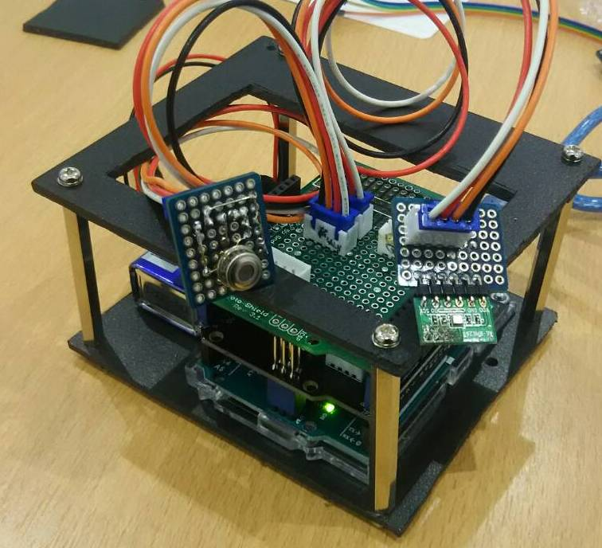
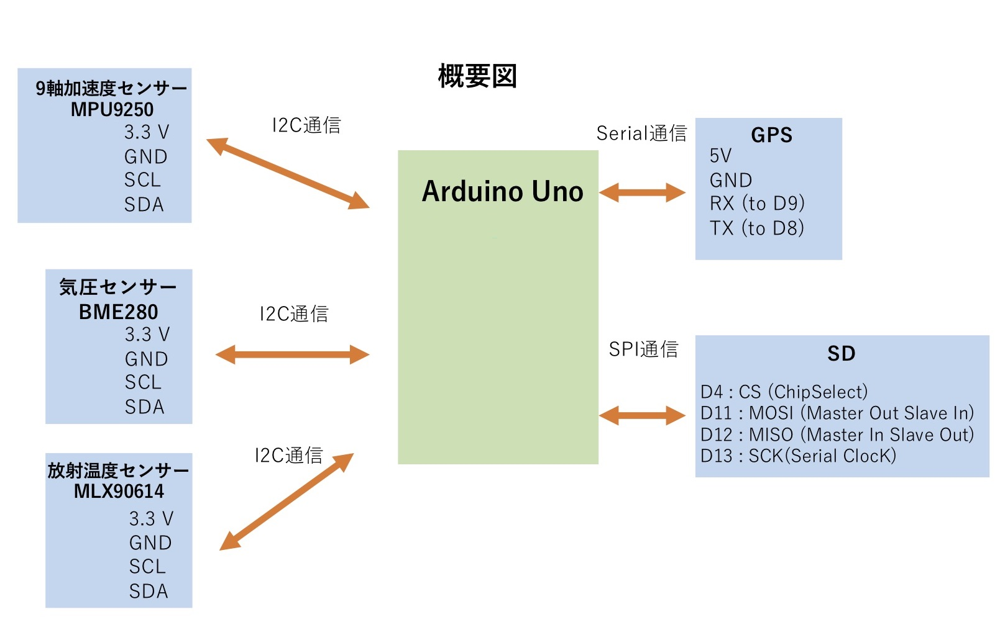
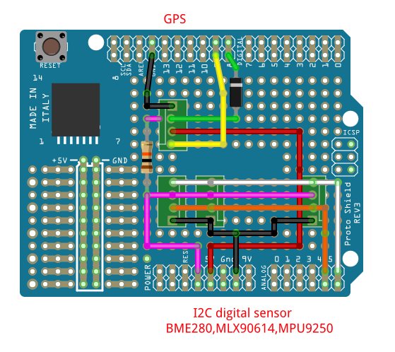

# Experiment Drone Falling
### ドローンからの落下実験 データ収集Arduino
written on 2018/12/19, by Yuta Nakamoto

## 観測内容
以下のリストをArduinoで観測している。
- 緯度、経度(GPS)
- 高度、気圧、気温(BME280)
- 気温(MLX90614)
- (今回は開発途中で使用していない)姿勢(MPU9250)

## 注意点
1. 9Dコンパスは使えない。
今回9Dコンパスにて姿勢を観測するつもりだったが、3.3V - 5V変換モジュールが壊れて、I2C通信用コネクタは3.3Vで設計したためである。
1. GPSを付けるコネクタの位置に注意する。I2C通信ではないので、(一応コネクタにGPSと名前をつけている。下の回路図参照)
1. 落下させた際、衝撃の影響でArduinoのリセットがかかることを確認しているが、データは取れていてArduinoもすぐに再スタートしているようなので今回は気にしないことにする。
1. SDカードに保存するファイル名は8文字以内にする。
(8文字以上にすると、SD.open()がエラーとなり、SDに書き込めない。)

## 使用部品
以下に使用した部品をまとめる。
- Arduino Uno R3  
https://www.switch-science.com/catalog/789/
- SDカードシールドV4 SEEED-103030005 (SeedStudio製)  
https://www.switch-science.com/catalog/1292/
- Arduino R3 互換 プロトシールド キット （プロトタイプシールド キット）  
https://www.amazon.co.jp/Arduino-プロトシールド-キット-（プロトタイプシールド-キット）/dp/B00LP9CT22
- BME280使用 温湿度・気圧センサーモジュールキット
http://akizukidenshi.com/catalog/g/gK-09421/
- GPS受信機キット 1pps出力付き 「みちびき」対応  
http://akizukidenshi.com/catalog/g/gK-09991/
- 赤外線温度センサーMLX90614  
https://strawberry-linux.com/catalog/items?code=18120
- (開発中)MPU9250 9軸センサーモジュール
https://strawberry-linux.com/catalog/items?code=12250

## センサーの概要
下図のような繋ぎ方をしている。
- I2C通信：BME280, MLX90614, MPU9250
- Serial通信：GPS
- SPI通信：SDカードシールド


## 回路図
上の概要を回路に直したものが下の回路図である。

上の１つのコネクタがシリアル通信用(GPS)で、
下の3つのコネクタがI2C通信用(3.3V)(BME280,MLX90614,MPU9250)である。
